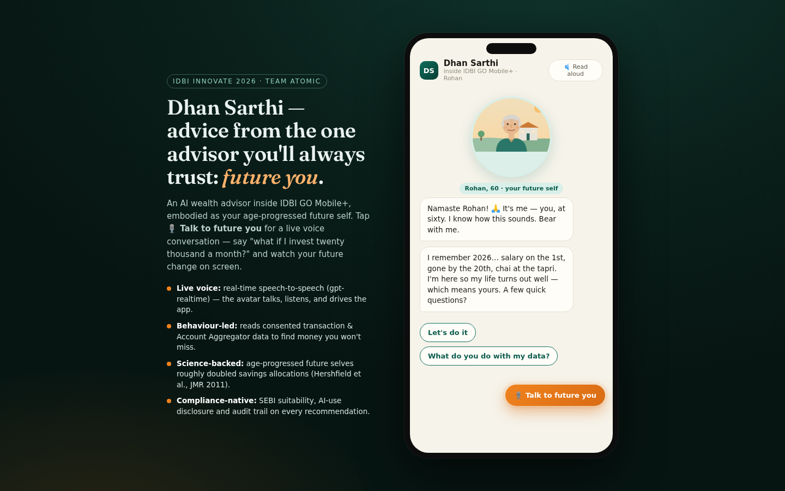
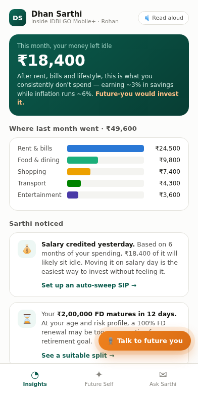
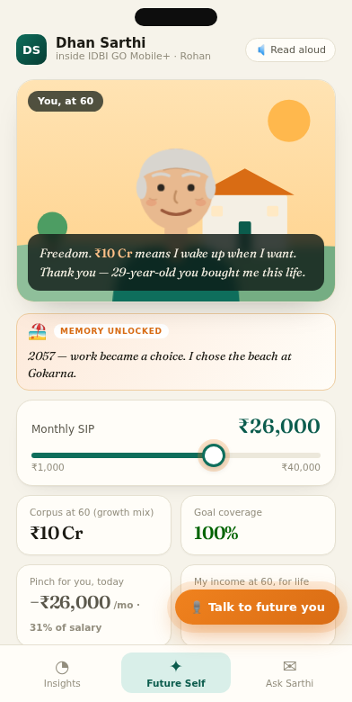
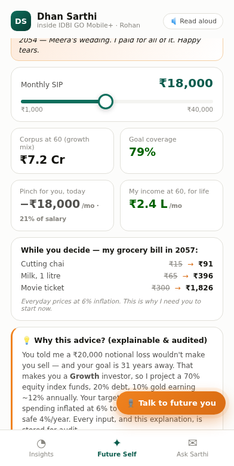
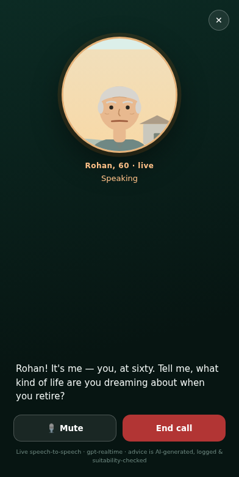
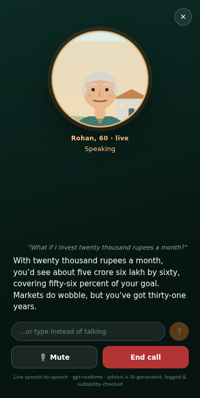

# Dhan Sarthi — meet your future self

**AI-powered, avatar-based digital wealth management inside IDBI GO Mobile+.**
Team Atomic · IDBI Innovate 2026 · Problem Statement 1 (Digital Wealth Management)

> The avatar isn't a mascot. It's *you, age-progressed to retirement* — because research
> shows people who interact with their future self save roughly twice as much
> (Hershfield et al., *Journal of Marketing Research*, 2011).



## The idea in 30 seconds

Wealth advice in India is fragmented and reserved for the affluent — only ~3–5% of Indians
invest in mutual funds, and RM-led advice can't economically reach the mass segment.
Dhan Sarthi gives **every IDBI customer a private banker**:

1. **Behaviour-led** — reads consented transaction data (in-bank + RBI Account Aggregator)
   to detect idle surplus, infer goals, and nudge proactively on salary day.
2. **Science-backed avatar** — your age-progressed future self delivers the advice. Drag the
   SIP slider and watch future-you's life visibly change. Documented behavioral mechanism,
   productized for the first time inside a regulated bank app in India.
3. **Compliance-native** — SEBI risk-profiling & suitability with audit trail, AI-use
   disclosure (SEBI Intermediaries Amendment, 2025), DPDP-consent flows, and human-RM
   escalation built in from day one.

| Insight engine | Future Self planner | Explainable advice |
|---|---|---|
|  |  |  |

## Try the demo

**Live:** see the deployment link on the repo sidebar.
Complete the 30-second avatar onboarding → explore the Insights dashboard → open the
**Future Self** tab and drag the SIP slider from ₹2,000 to ₹18,000.

### 🎙 Live voice call (the good part)

Tap **"Talk to future you"** and have a real-time spoken conversation with your
future self — powered by OpenAI's **gpt-realtime** speech-to-speech model over WebRTC.
Say *"what if I invest twenty thousand a month?"* and watch the agent move the SIP
slider itself, change its own world on screen, and narrate the projection it computed.
It can also navigate the app and book a human RM callback — all by voice, with live
captions and a typed fallback.

To enable it, paste an OpenAI API key when prompted. The key is stored **only in your
browser's localStorage** — it never appears in this repo, the deployed bundle, or any
server of ours. (In production this is the bank's own in-region hosted model — no
third-party keys.)

| Live call | Voice-driven planning |
|---|---|
|  |  |

Run locally:

```bash
npm install
npm run dev
```

## What's real in this PoC vs the production design

| This PoC (Phase 1) | Production (IDBI sandbox, Phase 2) |
|---|---|
| Scripted persona ("Rohan, 29") with mock 6-month transaction history | Live IDBI core-banking transactions + AA-consented external accounts |
| Stylised parameterised SVG future-self | Age-progressed rendering from the customer's consented photo |
| Rule-based nudges & canned advisory Q&A | LLM advisory layer with guardrails, grounded in the bank's product shelf (MF, FD, LIC insurance/annuities) |
| Deterministic SIP/corpus math (client-side) | Goal engine with Monte-Carlo projections + suitability service |
| Live speech-to-speech via OpenAI gpt-realtime (browser-supplied key) | Bank-hosted, in-region realtime voice models; 11 languages, matching IDBI GO Mobile+ |

## Stack

React + Vite PoC (this repo). Production architecture targets the bank's stack:
mobile SDK embedded in IDBI GO Mobile+, advisory microservices, AA/FIU integration,
model-audit store per SEBI's AI/ML governance framework.

---
*Projections shown are illustrative. Mutual fund investments are subject to market risks.*
